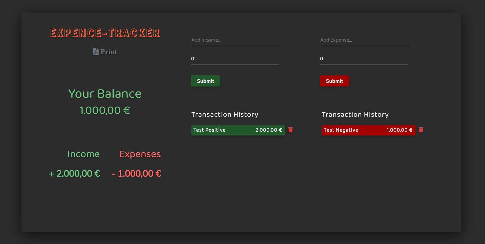
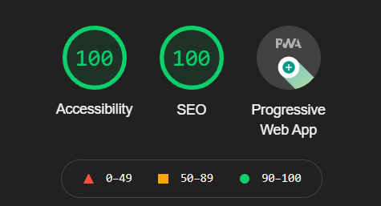
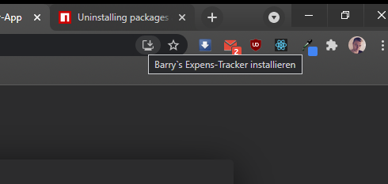
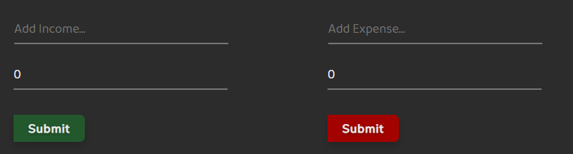
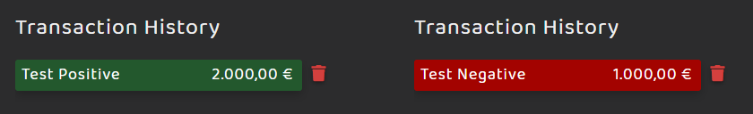
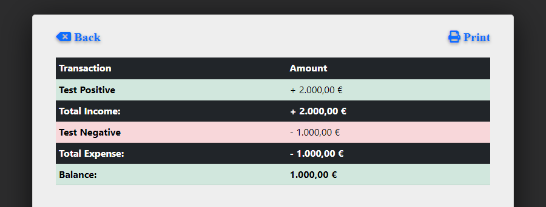

# Expense-Tracker



### Stack:

> React: creat-react-app
>
> Context-API - Hooks: useReducer, useContext
>
> CSS 3
>
> Bootstrap CDN v5.1.3
>
> Font-Awesome CDN v5.15.4
>
> Browser Local Storage
>
> PWA

# Webhosting and Status

One of the goals was to get a high rank in the Chrome Lighthouse test:

This is the Result:



## Deploy on Netlify

Status :

[](https://app.netlify.com/sites/barrys-expense-tracker/deploys)

Link to App:

https://barrys-expense-tracker.netlify.app

# Usage

You can use it direct in the Browser or as PWA!

Click in Browser on:



it will install on your divice and works offline to...

## How to use:

1.  Fill the form and submit:



2.  Track your transaction history or delete it...



3.  Get your Balance base on your history


4.  Print it...

Hit the Print button on top the Balance and get a preview site with your history in Table format!

Hit Print again and your system print window will start! Have fun !



# Installation

Use yarn package manager [yarn](https://yarnpkg.com/) to install

first go to the folder:

```bash
cd expense-tracker
```

```bash
yarn install
```

To start:

```bash
yarn start
```

# Project status

This is my final project for the Spiced Academy i hope you like it...

As an extension, I would add a log-in and date function. And Store the data in a database.
